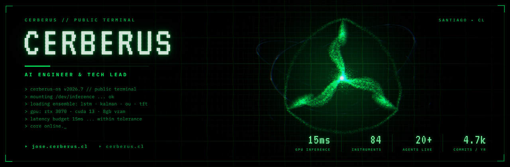
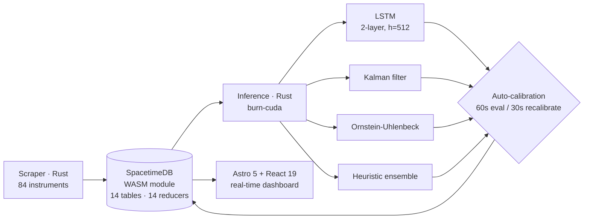
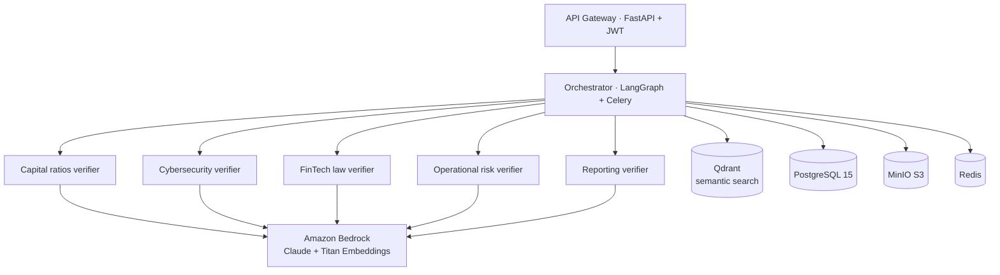
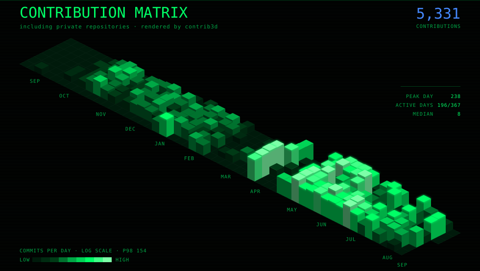

<div align="center">

<picture>
  <source media="(prefers-color-scheme: light)" srcset="assets/hero/v2/hero-light.webp">
  <source media="(prefers-color-scheme: dark)" srcset="assets/hero/v2/hero-dark.webp">
  
</picture>

**AI Engineer & Tech Lead** · CTO [@Cerberus Soluciones](https://cerberus.cl) · Sr. Tech Lead [@Open Source Integrators](https://opensourceintegrators.com)<br>
B.Sc. Physics, Universidad de Chile · Santiago, Chile

`~15 ms` GPU inference · `84` instruments traded · `20+` agents in production · <!-- BEGIN:commits -->4.8k<!-- END:commits --> commits/year

[**Portfolio** ▸ jose.cerberus.cl](https://jose.cerberus.cl) · [**Company** ▸ cerberus.cl](https://cerberus.cl) · [**LinkedIn** ▸ jose-ignacio-concha-araya](https://www.linkedin.com/in/jose-ignacio-concha-araya/)

</div>

---

```console
$ whoami
```

I build **AI systems that survive contact with production** — not demos. Ensembles that price
copper in under 15 ms, a Rust HFT engine that retrains on GPU every 10 seconds, and multi-agent
compliance pipelines that replace weeks of manual regulatory review for Chilean financial
institutions. Physicist by training, systems engineer by trade: I lead the team, design the
architecture, and write the production code.

Most of my work lives in private repositories. The panels below are generated daily from the
GitHub API and include that private activity in aggregate — the code stays closed, the volume
doesn't.

---

## Systems I've shipped

<table>
<tr><td width="50%" valign="top">

### AEON-COPPER Protocol
Real-time copper price prediction for trading desks. A five-model deep-learning ensemble over
80+ features — news sentiment, HMM regime detection, conformal prediction intervals — answering
in **under 15 ms** on GPU.

`TensorFlow 2.21` `PyTorch 2.11` `Rust` `ONNX` `SpacetimeDB` `FastAPI` `CUDA`

</td><td width="50%" valign="top">

### CMF Compliance Agent
Multi-agent regulatory review for Chilean banks. Five specialised verifiers (capital ratios,
cybersecurity, FinTech law) orchestrated through LangGraph over 11 containers. Replaces weeks
of manual document review.

`Amazon Bedrock` `LangGraph` `Qdrant` `PostgreSQL 17` `Redis 8.2` `Docker`

</td></tr>
<tr><td width="50%" valign="top">

### Cerberus HFT Engine
High-frequency trading engine tracking **84 Chilean and international instruments**. GPU LSTM
via `burn-cuda` fused with Kalman-filter and Ornstein-Uhlenbeck estimators. Retrains every
10 seconds. Written in Rust for the latency floor.

`Rust 1.94` `burn-cuda` `SpacetimeDB v2` `Astro` `Lightweight Charts`

</td><td width="50%" valign="top">

### AutoResearch
An autonomous agent that runs its own ML experiments — writes the code, trains, evaluates,
iterates. **~12 experiments/hour, ~100 overnight**, unattended, on a single consumer GPU.

`PyTorch 2.11` `CUDA` `Muon + AdamW`

</td></tr>
</table>

<details open>
<summary><b>Architecture — Cerberus HFT Engine</b></summary>



</details>

<details>
<summary><b>Architecture — CMF Compliance Agent</b></summary>



</details>

---

## Live telemetry

<!-- BEGIN:stats -->
> Regenerated daily from the GitHub API, private repositories included in aggregate.
> **98.1% of my commits and pull requests land in private repositories** —
> 4,577 against 87 public, across 27 closed repos. The code stays closed, the volume does not.
<!-- END:stats -->

<div align="center">

<!-- BEGIN:contrib3d -->

<!-- END:contrib3d -->



</div>

---

## The rig

Everything above is built, trained and benchmarked on hardware I own and tune myself.

| Node | Spec | Role |
|---|---|---|
| **CERBERUS-MAINFRAME** | Ryzen 7 7700 · RTX 3070 8 GB · 32 GB DDR5-6400 · 4 TB NVMe · Arch Linux + Hyprland | ML training, GPU inference, daily driver |
| **CERBERUS-HPC** | IBM X6 3850 · 48 vCPU · 512 GB RAM | Local LLM cluster — vLLM + RAG + hybrid web search |
| **CERBERUS-MOBILE** | ThinkPad T14 · i7-1165G7 · 32 GB · Arch Linux | Remote development |

`CUDA 13/12.x` `cuDNN` `eBPF` `ZFS` `SLURM` `Kubernetes` `Docker Swarm` `Terraform` `Ansible`

---

## Writing

Long-form essays on AI governance, ontological auditing and infrastructure. Published in
Spanish at [jose.cerberus.cl](https://jose.cerberus.cl).

<!-- BEGIN:writing -->
- **[Mythos, Roko y la zona ciega: el test epistémico que le hice a HAL 9000-CS](https://jose.cerberus.cl/blog/mythos-roko-test-epistemico/)** · <sub>2026-05-06</sub>
- **[Autoresearch mar14: Cuando HAL Optimizó un GPT Mientras Dormías](https://jose.cerberus.cl/blog/autoresearch-experimento-mar14/)** · <sub>2026-03-14</sub>
- **[Génesis: Cuando las Máquinas Comenzaron a Hablarme](https://jose.cerberus.cl/blog/genesis-fascinacion-inteligencia-artificial/)** · <sub>2026-02-02</sub>
- **[La Emergencia Silenciosa: Por Qué Su IA Corporativa Necesita Auditoría Ontológica](https://jose.cerberus.cl/blog/auditoria-ontologica-ia-empresarial/)** · <sub>2025-07-17</sub>
<!-- END:writing -->

---

<div align="center">

### Enter the mainframe

**[▸ l0rdbarcsacs.github.io](https://l0rdbarcsacs.github.io)** — this account rendered in WebGL:
the contribution calendar extruded into a city, the language distribution, and the systems
above in orbit. Static by construction, data baked from the API at deploy time.
[Source](https://github.com/l0rdbarcsacs/l0rdbarcsacs.github.io).

**[▸ jose.cerberus.cl](https://jose.cerberus.cl)** — a CRT-mainframe WebOS in Astro and raw
WebGL2: a living neural-network background, fourteen desktop apps, and a plain-text mode.

<!-- BEGIN:footer -->
<sub>Regenerated Aug 1, 2026, 12:44 a.m. · Santiago, Chile · every panel on this page is produced by a workflow in this repository</sub>
<!-- END:footer -->

</div>
